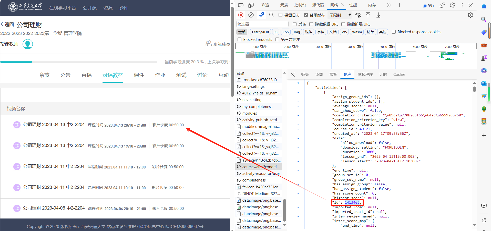

# class下载器

本工具用于下载西安交通大学[在线学习平台中](http://class.xjtu.edu.cn/)中的录播资源。

## 配置文件说明 (`config`)

- `url`：录播列表的链接（json）。
- `activity_url`：每个视频的链接（json）。通过这个json文件可以获取视频的下载地址。
- `course_id`：课程ID。例如，在链接`http://class.xjtu.edu.cn/course/40121/lesson#/`中，`40121`即为`course_id`。
- `cookie`：用于下载资源的cookie。`url`和`activity_url`使用同一个cookie，但不同的资源可能需要不同的cookie。
- `page_size`：指定每页显示的视频数量。为避免翻页，建议将此值设置为等于或高于视频总数的值。例如，32学时的课程通常有32个视频。

## 流程

1. 从下图中拿到包含所有视频的json文件

   

2. 根据json文件拿到`activity id`

3. 根据`activity id`拿到包含视频地址的json文件

4. 下载视频